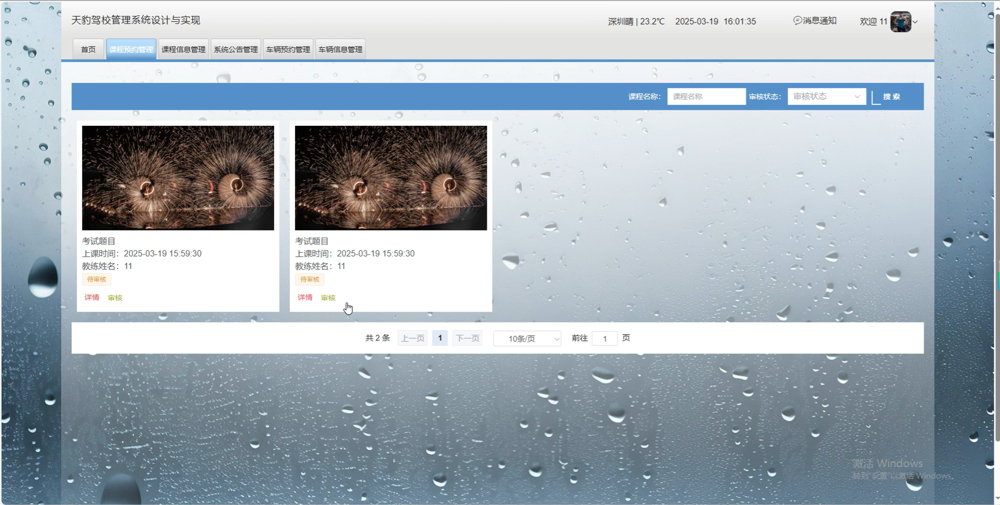

# springbootA427D
springbootA427D天豹驾校管理系统+LW
 
## 查看主页获取源码

### 一、关键词
驾校课程预约管理、驾校车辆预约管理、驾校课程信息管理

### 二、作品包含
源码+数据库+设计文档万字+全套环境和工具资源+本地部署教程

### 三、项目技术
前端技术：Html、Css、Js、Vue3.0、Element-plus 
后端技术：Java、SpringBoot3.0、MyBatis

### 四、运行环境（以下版本亲测，其他版本未知，请自测）
开发工具：IDEA/eclipse  + VSCODE

数据库：MySQL5.7（最低要5.7版本）

数据库管理工具：Navicat10以上版本

环境配置软件： JDK17 + Maven3.6.3

前端Nodejs：20

浏览器：谷歌浏览器

### 五、项目介绍
项目编号：springbootA427D

天豹驾校管理系统，可实现课程等全方位管理，提升运营效率与服务质量，为驾校决策提供数据支持。

角色：管理员、用户、教练

用户功能：首页、车辆信息、课程信息、个人中心、修改密码、车辆预约、消息通知、课程预约、我的收藏。

教练功能：首页、课程预约管理、课程信息管理、系统公告管理、车辆预约管理、车辆信息管理、消息通知、个人中心。

管理员功能：首页、车辆类型管理、课程信息管理、系统公告管理、教练管理、轮播图管理、车辆预约管理、用户管理、课程类型管理、菜单管理、车辆信息管理、课程预约管理、消息通知、个人中心。

### 六、运行截图

